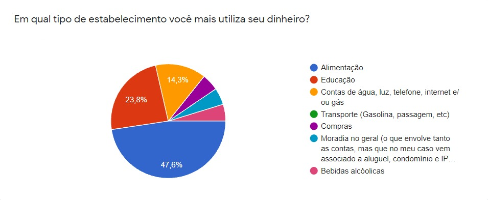

# Introdução

## Problema
Como fazer para comparar preços de produtos a serem adquiridos em supermercados físicos e com isso realizar um maior controle dos gastos?

## Objetivos
Desenvolver um software para auxiliar os consumidores na comparação de preços de produtos a serem adquiridos em supermercados, individualmente ou a partir da elaboração de lista de compras, possibilitando um maior controle de gastos.

Objetivos Específicos:
- permitir que os consumidores informem o preço de produtos vendidos em supermercados;
- permitir que os consumidores comparem os preços de produtos vendidos em supermercados, a partir dos dados fornecidos por outros consumidores;
- permitir que os consumidores elaborem listas com os produtos que costumam adquirir em supermercados e comparar os preços entre diversos estabelecimentos, a partir dos dados fornecidos por outros consumidores;

## Justificativa
O desenvolvimento deste software visa atender a demanda de pesquisa de preços por consumidores que regularmente realizam compras em supermercados para suprimento das necessidades da família, viabilizando assim melhor controle de gastos. 

Atualmente, para compras realizadas virtualmente, os consumidores possuem facilidade em comparar preços dos produtos. Embora as compras via internet estejam se intensificando, para alguns tipos de produtos, ainda prevalece a forma presencial. 

Em estudos iniciais de desenvolvimento deste software foram realizadas pesquisas nas quais apontaram que 48% da população entrevistada utiliza a maior parte de sua renda com alimentação.

Ocorre que, desta forma, a possibilidade de comparação de preços fica bastante limitada. Considerando a frequencia que a maioria das pessoas vai ao supermercado, as oscilações dos preços dos produtos comumente adquiridos nestes estabelecimentos e as dificuldades e custos inerentes ao deslocamento, o consumidor, muitas vezes, acaba comprando no local que lhe pareça mais conveniente ou mais barato, sem saber ao certo quanto pode estar gastando a mais ou a menos. 

Ainda que a variação de preços da maioria dos produtos possa não ser tão significativa, é do interesse do consumidor ter acesso a essa informação. Além disso, como, com frequência, em supermercados, o consumidor costuma adquirir diversos itens, pode ser que a variação de preços, ainda que pequena, no total, impacte no orçamento do consumidor. 

Dessa forma, o objetivo é fornecer uma ferramenta simples que municie o consumidor com informações que possibilitem compras mais conscientes em supermercados (lojas físicas), propiciando um melhor controle dos gastos. 

## Público-Alvo

- Consumidores, prioritariamente entre 25-50 anos de idade, de classe média, que regularmente realizam compras em supermercados para suprimento das necessidades da família.