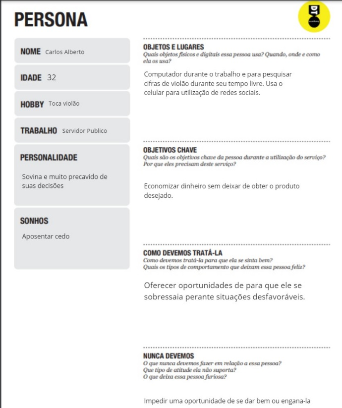
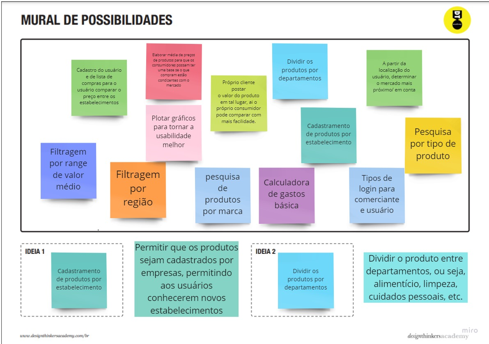
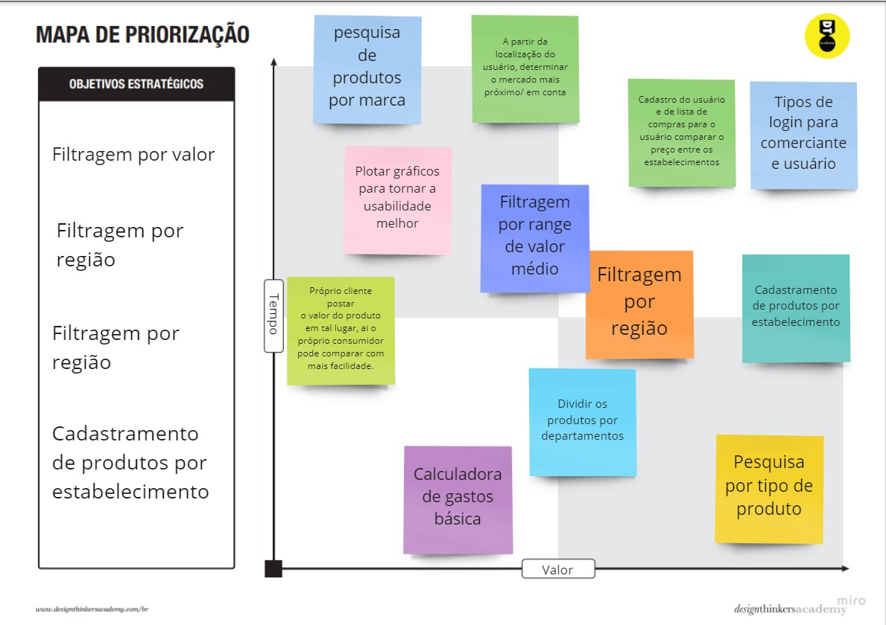

# Especificações Do Projeto

Pré-requisitos: <a href="1-Contexto.md"> Documentação de Contexto</a>

Nesse tópico serão apresentadas as personas, as histórias de usuários, os requisitos funcionais e não funcionais, assim como os projetos feitos no Miro para as estruturas, as funcionalidades e os alvos que o projeto pretende alcançar.

## Personas
Persona base para desenvolvimento das demais:

Carlos Alberto tem 32 anos, trabalha como funcionário público e tem o sonho de se
aposentar cedo. Já é casado e possui 2 filhos. Passa boa parte do tempo do seu dia no
computador e toca violão no seu tempo livre. É o único sustento da família e tem como objetivo
chave economizar dinheiro e estar preparado para situações financeiras adversas. Está
sempre atento à situação econômica e política do país.

Giovana possui 25 anos, mora em uma república e estuda artes cênicas em uma faculdade de  particular com bolsa. Faz estágio. Tem o sonho de se mudar para fora do país ou se possível
conseguir uma bolsa de estudos no exterior. Tem como hobby sair com os amigos e reunir com a família. Sempre que possível envia parte da sua renda para auxliar a família.

Felipe tem 27 anos e é recém formado no curso de Ciência da Computação. Acaba de se mudar para
São Paulo por conta de uma oportunidade de emprego. Apesar disso, teve um aumento dos seus gastos, pois o custo de vida em São Paulo é mais alto. Possui
2 cachorros e mora na região central da cidade. Gosta de passar o seu tempo livre lendo
ou programando projetos pessoais que vão além da sua ferramenta principal de trabalho.
Costuma passar bastante tempo assistindo jornais e acompanhando notícias do setor financeiro.

## Histórias de Usuários

Com base na análise das personas forma identificadas as seguintes histórias de usuários:

|EU COMO... `PERSONA`| QUERO/PRECISO ... `FUNCIONALIDADE` |PARA ... `MOTIVO/VALOR`                 |
|--------------------|------------------------------------|----------------------------------------|
|Clientes (Compradores)  | Encontrar mercados que vendem mais barato          | Economizar no meu gasto mensal com mantimentos               |
|Vendedor       | Alcançar clientes e veicular minhas promoções                  | Aumentar o meu número de clientes e elevar a minha rentabilidade |

## Requisitos

As tabelas que se seguem apresentam os requisitos funcionais e não funcionais que detalham o escopo do projeto.

### Requisitos Funcionais

### Mural de possibilidades com as ideias propostas pela equipe
  

### Mapa de priorização das demandas e funcionalidades
  

|ID    | Descrição do Requisito  | Prioridade |
|------|-----------------------------------------|----|
|RF-001| Permitir que as lojas cadastrem produtos | ALTA | 
|RF-002| Permitir busca por produtos por clientes  | ALTA |
|RF-003| Permitir filtragem de produtos por preço   | ALTA |
|RF-004| Diferenciação no login de Compradores e Vendedores   | MEDIA |
|RF-005| Cadastro de lista de compras para comparação de preços  | MEDIA |
|RF-006| Permitir filtragem de produtos por categoria  | MEDIA |
|RF-007| Sinalizar estabelecimentos próximos para o comprador  | MEDIA |
|RF-008| Plotar gráficos para exibir valores  | BAIXA |
|RF-009| Permitir filtragem de produtos por marca  | BAIXA |
|RF-010| Calculadora básica  | BAIXA |

### Requisitos não Funcionais

|ID     | Descrição do Requisito  |Prioridade |
|-------|-------------------------|----|
|RNF-001| O sistema deve ser responsivo para rodar em um dispositivos móvel | MÉDIA | 
|RNF-002| Deve processar requisições do usuário em no máximo 3s |  BAIXA | 

## Restrições

O projeto está restrito pelos itens apresentados na tabela a seguir.

|ID| Restrição                                             |
|--|-------------------------------------------------------|
|01| O projeto deverá ser entregue até o final do semestre |
|02| Não pode ser desenvolvido um módulo de backend        |
|03| Deve ser uma solução nativa para WEB                  |
