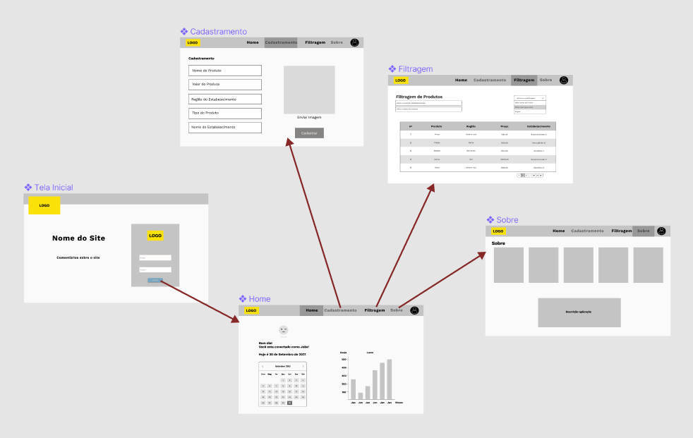

# Projeto de Interface

Pré-requisitos: <a href="2-Especificação.md"> Documentação de Especificação</a>

O software a ser criado é uma aplicação web. Foram elaboradas cinco telas: "login", "home", "cadastramento", "filtragem" e "sobre". A tela inicial é a tela de login, na qual o usuário realiza o seu cadastro e o encaminha para a tela "home", na qual tem acesso às demais telas.
Na tela cadastramento, o usuário poderá fazer o cadastramento do nome, valor e tipo do produto, além do nome do estabelecimento e a região na qual o estabelecimento está localizado.
Na tela filtragem, o usuário consegue realizar a pesquisa de produtos por nome do estabelecimento e por nome do produto e ordenar o resultado da pesquisa por região e por preço.
Na tela sobre, está localizada a descrição da aplicação e as informações sobre a equipe que desenvolveu o produto, os integrantes do grupo.

## User Flow

## Wireframes

[Link para o play do Marvel APP](https://marvelapp.com/prototype/77dcj27/screen/82328386)

>> Login

>> Home

>> Cadastramento

>> Filtragem

>> Sobre

