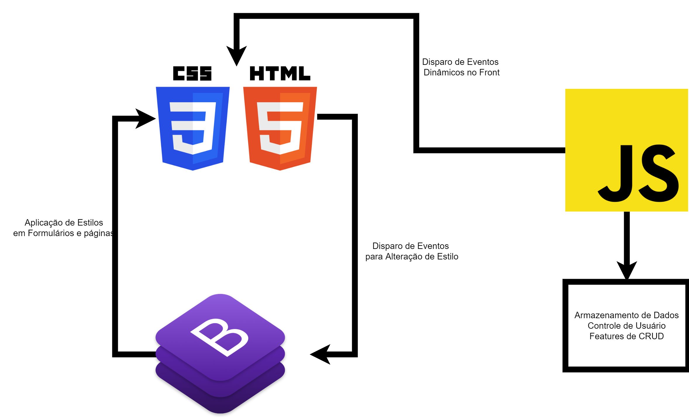

# Projeto da Solução

Pré-requisitos: <a href="4-Gestão-Configuração.md"> Ambiente e Ferramentas de Trabalho</a>

## Tecnologias Utilizadas

Ao longo do projeto foram utilizadas ferramentas simples para desenvolvimento da aplicação. O software se fundamenta no uso de HTML5, Bootstrap, JQuery e JavaScript Vanilla. Além disso, é interessante dar um foco ao uso do Canvas, utilizado para o desenvolvimento dos gráficos.

Foi utilizado o Visual Studio Code como IDE de desenvolvimento assim como o GitHub Desktop para controle do versionamento.

## Arquitetura da solução

O fluxo do usuário se inicia na tela de Login no qual ele pode se cadastrar ou conectar a sua conta caso já possua o cadastro.

Ao acessar com sua conta, ele é redirecionado a Home no qual o usuário pode acessar diversas telas da aplicação.

Ao clicar em **Controle de Gastos** o usuário é redirecionado para a tela na qual ele pode cadastrar produtos de diversas categorias nas datas desejadas, com o valor e nome desejado.
Após registrar os produtos, ele pode se direcionar as duas telas adicionais que são **Gastos por Categoria** e **Gastos por Dia**. Ambas funcionam como ferramentas de visualuzação. Na tela de **Gastos por Categoria** o usuário pode ver quais categorias consumiram mais os seus gastos por meio de um gráfico de setor. Já na tela de **Gastos por Dia** a visualização disponibilzada leva em conta o dia cadastrado para cada gasto, mostrando em um gráfico de barras o gasto toal de cada dia.

Outra tela disponibilizada é a de **Produtos** que permite ao usuário cadastrar, alterar e deletar diversos produtos que ele possui interesse.

Outo caminho possível é a tela de **Estabelecimentos**. Essa tela também funciona como um catálogo de Estabelecimentos que o usuário quer registrar levando em conta o Nome e a Região de cada um deles.

Na tela de **Estoque** é possível o usuário cadastrar uma correlação entre produtos, estabelecimentos e demais valores, assim como editá-los e deletá-los.

Na **Filtragem** o usuário possui a capacidade de filtrar os produtos e ver onde estão disponíveis em cada estabelecimento assim como fazer a filtragem por estabelecimetnos.

