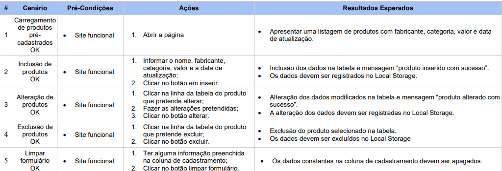
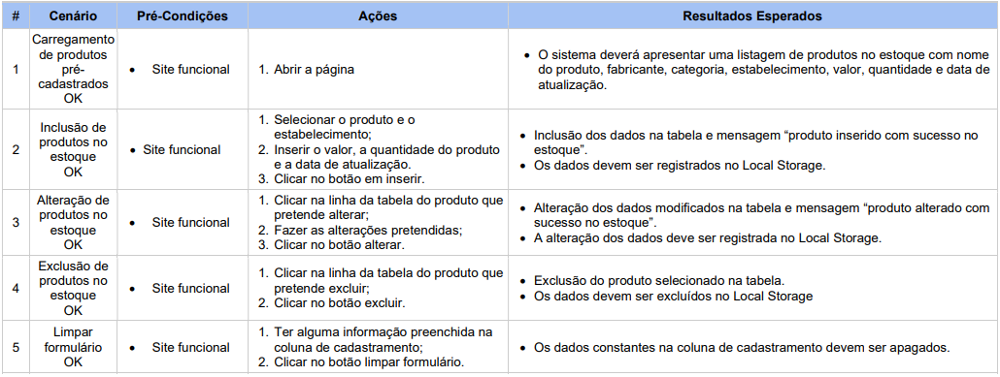
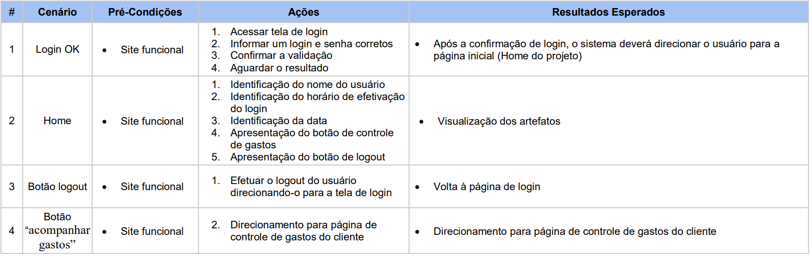
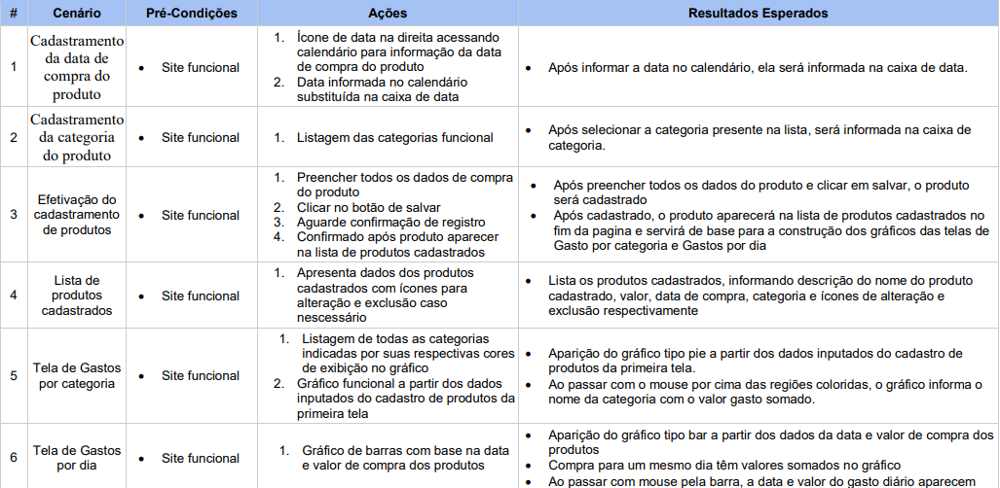
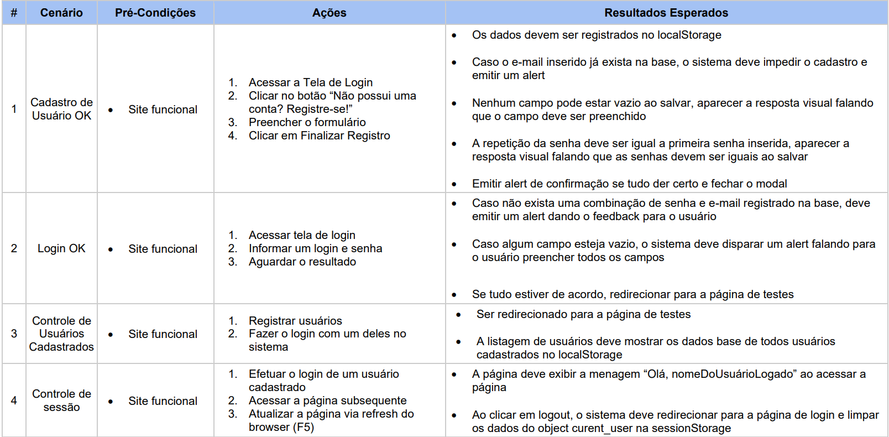
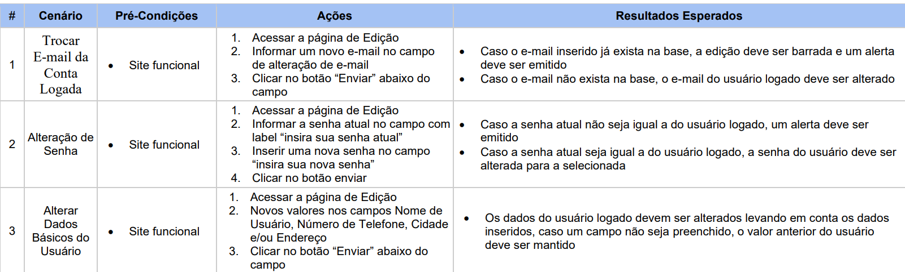
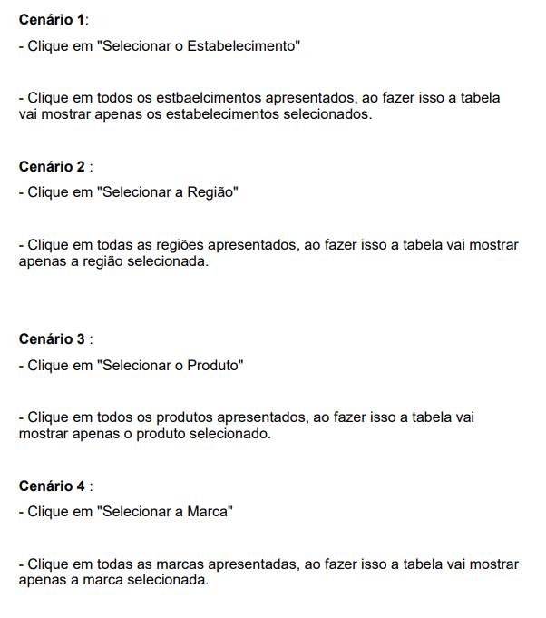
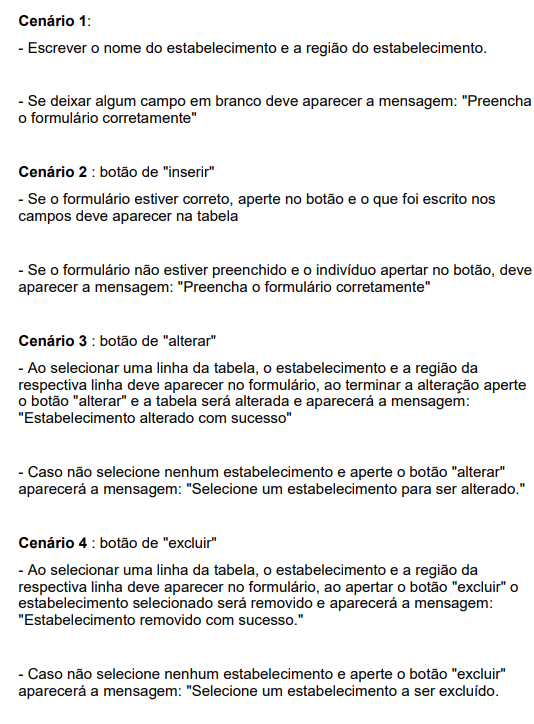

# Avaliação da Aplicação

Pré-requisitos: <a href="6-Implementação.md"> Projeto da Solução</a>

## Plano de Testes

### Funcionalidade de cadastramento de produtos

### Funcionalidade de cadastramento de estoque

### Funcionalidade da Home

### Funcionalidade Controle de Gastos

### Funcionalidade de Cadastro e Login de Usuário

### Funcionalidade de Edição de Usuário

### Filtragem de Estoque

### Cadastramento de Estabelecimentos
